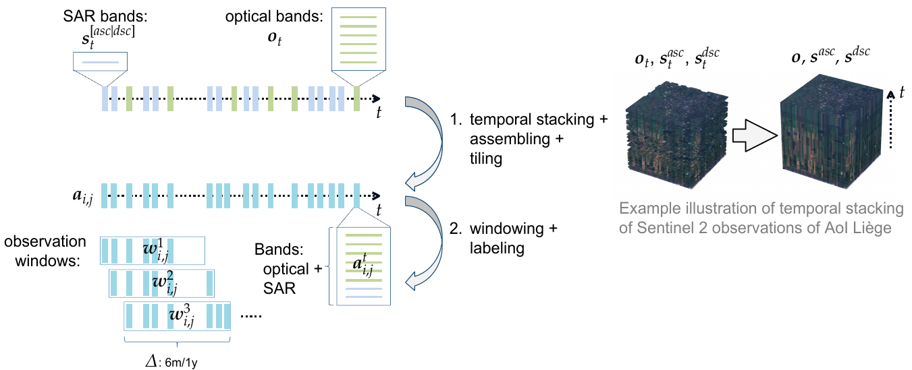
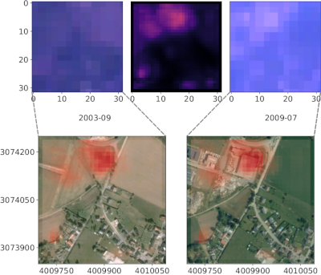
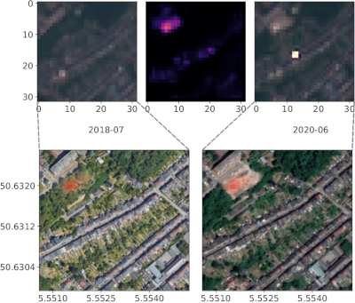
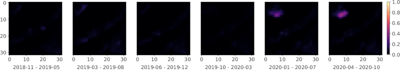

**Table of Contents:**
- [ERCNN-DRS Urban Change Monitoring](#ercnn-drs-urban-change-monitoring)
  * [Features](#features)
  * [Usage](#usage)
    + [Pre-Requisites](#pre-requisites)
    + [Pre-Processing](#pre-processing)
    + [Model Architecture](#model-architecture)
    + [Training](#training)
    + [Inference](#inference)
  * [Examples](#examples)
    + [ERS-1/2 & Landsat 5 TM](#ers-12--landsat-5-tm)
    + [Sentinel 1 & 2](#sentinel-1--2)
- [Paper and Citation](#paper-and-citation)
- [Contact](#contact)
- [Acknowledgements](#acknowledgements)
- [License](#license)

# ERCNN-DRS Urban Change Monitoring
This project hosts the *Ensemble of Recurrent Convolutional Neural Networks for Deep Remote Sensing* (ERCNN-DRS) used for urban change monitoring with ERS-1/2 & Landsat 5 TM, and Sentinel 1 & 2 remote sensing mission pairs. It was developed for demonstration purposes (study case) in the ESA Blockchain ENabled DEep Learning for Space Data (BLENDED)1 project.
Two neural network models were trained for the two eras (ERS-1/2 & Landsat 5 TM: 1991-2011, and Sentinel 1 & 2: 2017-2021).

Below is an example of ERCNN-DRS continuous urban change monitoring with Sentinel 1 & 2 data (AoI of Liège). It uses  **deep-temporal multispectral and SAR remote sensing observations** to make predictions of urban changes over a time window of half a year (right). The higher the values, the more likely an urban change was detected within that window. Left are true color observations of start of the respective window for orientation only. [external link to YouTube]

The repository at hand contains only the study case of the BLENDED platform. It can be run on any arbitrary environment or within the BLENDED platform. For the former, IPFS (InterPlanetary File System) is not needed and data can be stored on any file system. The following figure shows the core of the study case with two phases: training with blue arrows and inference (i.e. prediction) with orange arrows. Green arrows denote both training and inference phases.

<!---->

  

Dashed boxes (processing steps) are not contained here. The actors denote different roles in the BLENDED platform (model owner, data owner and result owner) which are also not relevant for the study case.

## Features
- Trained with SAR and optical multispectral observation time series of hundreds up to thousands of observations (deep-temporal)
- Demonstrates usage for two mission pairs:
    - ERS-1/2 & Landsat 5 TM (1991-2011), and 
    - Sentinel 1 & 2 (2017-now)
- Predicts changes which happened in one time window:
    - 1 year for ERS-1/2 & Landsat 5 TM, and
    - 6 months for Sentinel 1 & 2
- The long mission times allow monitoring of urban changes over larger time frames

## Usage
### Pre-Requisites
For either era, SAR (separated by ascending and descending orbit directions) and multispectral optical observations are needed as EOPatches, a format introduced by [eo-learn](https://github.com/sentinel-hub/eo-learn).

The AoI shapefiles can be found in the respective subdirectories:
- ERS-1/2 & Landsat 5 TM: [`Rotterdam.shp`](./ERS12_LS5/AoIs/), [`Liege.shp`](./ERS12_LS5/AoIs/), and [`Limassol.shp`](./ERS12_LS5/AoIs/) (EPSG:3035)
- Sentinel 1 & 2: [`Rotterdam.shp`](./Sentinel1_2/AoIs/), [`Liege.shp`](./Sentinel1_2/AoIs/), and [`Limassol.shp`](./Sentinel1_2/AoIs/) (EPSG:4326)

### Pre-Processing
Before training, observations from EOPatches need to be processed in two steps:
<!---->

  

1. Temporally stacking, assembling and tiling (creates temporary TFRecord files):
    - ERS-1/2 & Landsat 5 TM: [`1_tstack_assemble_tile.py`](./ERS12_LS5/preproc/)
    - Sentinel 1 & 2: [`1_tstack_assemble_tile.py`](./Sentinel1_2/preproc/)
2. Windowing and labeling (output: TFRecord files):
    - ERS-1/2 & Landsat 5 TM: [`2_generate_windows_slabels.py`](./ERS12_LS5/preproc/)
    - Sentinel 1 & 2: [`2_generate_windows_slabels.py`](./Sentinel1_2/preproc/)

### Model Architecture
<!---->

  

### Training
Training is executed on the windowed and labeled TFRecord files:
  - ERS-1/2 & Landsat 5 TM: [`train.py`](./ERS12_LS5/train/)
  - Sentinel 1 & 2: [`train.py`](./Sentinel1_2/train/)

### Inference
We provide pre-trained networks which can be used right away:
  - ERS-1/2 & Landsat 5 TM: [`best_weights_ercnn_drs.hdf5`](./ERS12_LS5/train/snapshots/)
  - Sentinel 1 & 2: [`best_weights_ercnn_drs.hdf5`](./Sentinel1_2/train/snapshots/)

## Examples
### ERS-1/2 & Landsat 5 TM
ERS-1/2 & Landsat 5 TM example of Liège. Top row are Landsat 5 TM true color observations (left, right) with change prediction (middle). Bottom rows are corresponding very-high resolution imagery from Google Earth(tm), (c) 2021 Maxar Technologies with predictions superimposed in red.

<!---->

  

 Series of predictions from above example.

<!---->

  

### Sentinel 1 & 2
Sentinel 1 & 2 example of Liège. Top row are Sentinel 2 true color observations (left, right) with change prediction (middle). Bottom rows are corresponding very-high resolution imagery from Google Earth(tm), (c) 2021 Maxar Technologies with predictions superimposed in red.

<!---->

  

 Series of predictions from above example.

<!---->

  

# Paper and Citation
The full paper can be found at [MDPI Remote Sensing](https://www.mdpi.com/2072-4292/13/15/3000).

    @Article{rs13153000,
        AUTHOR = {Zitzlsberger, Georg and Podhorányi, Michal and Svatoň, Václav and Lazecký, Milan and Martinovič, Jan},
        TITLE = {Neural Network-Based Urban Change Monitoring with Deep-Temporal Multispectral and SAR Remote Sensing Data},
        JOURNAL = {Remote Sensing},
        VOLUME = {13},
        YEAR = {2021},
        NUMBER = {15},
        ARTICLE-NUMBER = {3000},
        URL = {https://www.mdpi.com/2072-4292/13/15/3000},
        ISSN = {2072-4292},
        DOI = {10.3390/rs13153000}
    }

# Contact
Should you have any feedback or questions, please contact the main author: Georg Zitzlsberger (georg.zitzlsberger(a)vsb.cz).

# Acknowledgements
This research was funded by ESA via the Blockchain ENabled DEep Learning for Space Data (BLENDED) project (SpaceApps Subcontract No. 4000129481/19/I-IT4I) and by the Ministry of Education, Youth and Sports from the National Programme of Sustainability (NPS II) project “IT4Innovations excellence in science - LQ1602” and by the IT4Innovations Infrastructure, which is supported by the Ministry of Education, Youth and Sports of the Czech Republic through the e-INFRA CZ (ID:90140) via the Open Access Grant Competition (OPEN-21-31).

The authors would like to thank ESA for funding the study as part of the BLENDED project1 and IT4Innovations for funding the compute resources via the Open Access Grant Competition (OPEN-21-31). Furthermore, the authors would like to thank the data providers (USGS, ESA, Sentinel Hub and Google) for making remote sensing data freely available. The authors would finally like to thank the BLENDED project partners for supporting our work as a case study of the developed platform.

1 [Valentin, B.; Gale, L.; Boulahya, H.; Charalampopoulou, B.; Christos K., C.; Poursanidis, D.; Chrysoulakis, N.; Svato&#x0148;, V.; Zitzlsberger, G.; Podhoranyi, M.; Kol&#x00E1;&#x0159;, D.; Vesel&#x00FD;, V.; Lichtner, O.; Koutensk&#x00FD;, M.; Reg&#x00E9;ciov&#x00E1;, D.; M&#x00FA;&#x010D;ka, M. BLENDED - USING BLOCKCHAIN AND DEEP LEARNING FOR SPACE DATA PROCESSING. Proceedings of the 2021 conference on Big Data from Space; Soille, P.; Loekken, S.; Albani, S., Eds. Publications Office of the European Union, 2021, JRC125131, pp. 97-100.  doi:10.2760/125905.](https://op.europa.eu/en/publication-detail/-/publication/ac7c57e5-b787-11eb-8aca-01aa75ed71a1)

# License
This project is made available under the GNU General Public License, version 3 (GPLv3).
