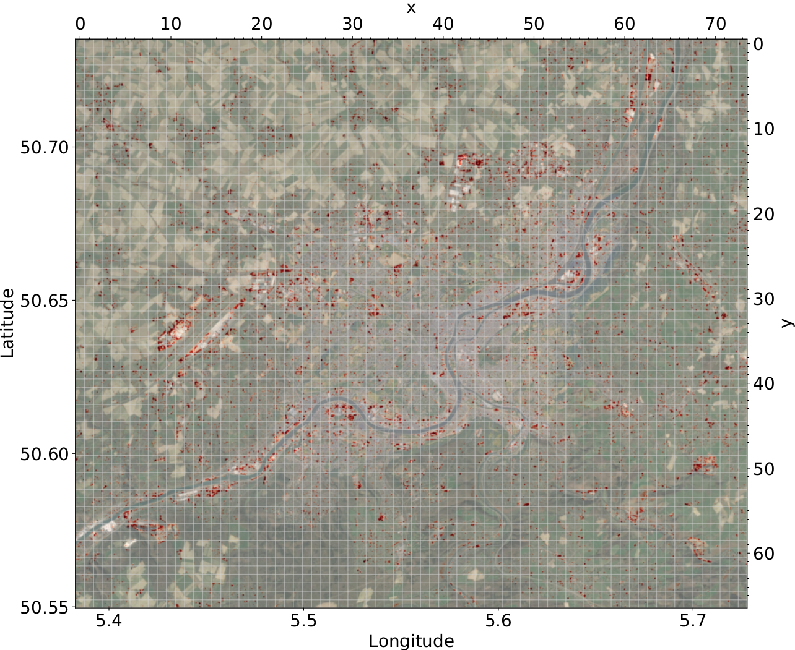

**Table of Contents:**
- [Transfer Learning with ERCNN-DRS](#transfer-learning-with-ercnn-drs)
- [Training/Validation Datasets](#trainingvalidation-datasets)
- [Training](#training)
- [Trained Models](#trained-models)
- [Paper and Citation](#paper-and-citation)
- [Contact](#contact)
- [Acknowledgments](#acknowledgments)
- [License](#license)

# Transfer Learning with ERCNN-DRS
The trained baseline of the ERCNN-DRS model ([`baseline.hdf5`](./models/baseline.hdf5)) leveraged synthetic labels to provide a temporal resolution needed to train with each observational window (6 months for Sentinel 1 & 2). When transferring and fine tuning the pre-trained model to a new location, sufficient data might not be available or is hard to come by to label each window (sample) properly.

In the underlying subsequent work, we introduce a novel approach to aggregate multiple observational windows, to simplify manual labelling. We demonstrate this for the AoI Liège (Belgium) with using only a small number of tiles (set of samples) and approximated labels, based on publicly available data from Google Earth historic imagery. The aggregation spans the years 2017-2020 by training with all windows within that period at once. The selected tiles with their labels (GeoTIFFs), shape files, and a pair of very high resolution imagery from Google Earth can be found in the directory [`ground_truth`](./ground_truth/).

As a result, the automatically pre-trained baseline enables a per-window analysis of urban changes, whereas the subsequent transfer tailors the pre-trained network towards a specific AoI with minimal manual efforts while retaining the properties of window based analysis.

**Example for area of Liège:**\
Urban changes in Liège 2017-2020 with combined models V1-3. Highlights in red show identified urban changes for every tile. Background image ©2019/20 Google Earth, for reference only.

  

Changes with a six month moving window with window mid-point range March 2017 - Oct. 2020 (step size of 5):

  

Video file is located [here](./collateral/Liege_01_2017-01_2021.mp4).

# Training/Validation Datasets
Thanks to the data providers, we can make available the [`training/validation datasets`](https://drive.google.com/drive/folders/1CLTna5fNLTEEWwELK6hXoN5C42yaXvQf?usp=sharing) on Google Drive.

**Note:** The training/validation datasets are `TFRecord` files, with one file for each tile and each tile containing all windows from 2017-2020. Two features are availble, with one describing the time series of observations for each window and a label. The label is the synthetic ground truth which is not used for transfer learning! Instead labels need to be loaded separately from folder [`training/numpy_ground_truth`](./training/numpy_ground_truth/).

**ATTENTION, these files are large!**
- [V1](https://drive.google.com/file/d/1u_bX6VntdRMoQT8VdQ3YrhCaHtBz6Ndt/view?usp=share_link) [147.34 GB]
- [V2](https://drive.google.com/file/d/1vm2yXWLuSyprI1IxZhWKrLl8JgbgPO4E/view?usp=share_link) [147.34 GB]
- [V3](https://drive.google.com/file/d/16EA7ExyyJ-6UT1AYzMThBOF1vXxKmDLD/view?usp=share_link) [147.34 GB]

Extract the tar balls `V[1-3].tar` in the respective subdirectories [`./training/V1/`](./training/V1/), [`./training/V2/`](./training/V2/), and [`./training/V3/`](./training/V3/).

Versions `V[1-3]` are using different subsets of tiles for training, with valiation tiles being disjunct.

# Training
Execute the training script [`training/train.py`](./training/train.py). It is recommended to use the NVIDIA GPU Cloud Tensorflow container [`docker://nvcr.io/nvidia/tensorflow:22.02-tf2-py3`](https://catalog.ngc.nvidia.com/orgs/nvidia/containers/tensorflow) and at least eight GPUs with a total of 320 GB of memory (8x40 GB).

Change the variable `exp` to the version to train, e.g. `exp = "V1"`.

# Trained Models
We provide all trained [`models`](./models/):
- Pre-trained model:
  - [`baseline.hdf5`](./models/baseline.hdf5): see [original work](../../../)
- Ab initio trained models:
  - [`V1_abinitio_149.h5`](./models/V1_abinitio_149.h5): First ab initio model from partial cross-validation (epoch 149)
  - [`V2_abinitio_147.h5`](./models/V2_abinitio_147.h5): Second ab initio model from partial cross-validation (epoch 147)
  - [`V3_abinitio_181.h5`](./models/V3_abinitio_181.h5): Third ab initio model from partial cross-validation (epoch 181)
- Transferred models:
  - [`V1_transfer_111.h5`](./models/V1_transfer_111.h5): First transferred model from partial cross-validation (epoch 111)
  - [`V2_transfer_78.h5`](./models/V2_transfer_78.h5): Second transferred model from partial cross-validation (epoch 78)
  - [`V3_transfer_107.h5`](./models/V3_transfer_107.h5): Third transferred model from partial cross-validation (epoch 107)

# Other Use Case
A similar transfer method has also been used to monitor urban changes in Mariupol/Ukraine 2022/23. That use case is hosted as a dedicated project [here](https://github.com/It4innovations/urban_change_monitoring_mariupol_ua).

# Paper and Citation
The full paper can be found at [International Journal of Remote Sensing](TBD). **not online yet**

    @Article{doi:10.1080/01431161.2023.2243021,
        AUTHOR = {Zitzlsberger,Georg and Podhoranyi,Michal and Martinovic,Jan},
        TITLE = {A Practically Feasible Transfer Learning Method for Deep-Temporal Urban Change Monitoring},
        JOURNAL = {International Journal of Remote Sensing},
        YEAR = {2023},
        DOI = {10.1080/01431161.2023.2243021},
    }

# Contact
Should you have any feedback or questions, please contact the main author: Georg Zitzlsberger (georg.zitzlsberger(a)vsb.cz).

# Acknowledgments
This research was funded by the IT4Innovations infrastructure which is supported from the Ministry of Education, Youth and Sports of the Czech Republic through the e-INFRA CZ (ID:90140) via Open Access Grant Competition (OPEN-21-31). The authors would like to thank the data providers (Sentinel Hub and Google) for making the used remote sensing data freely available:
- Contains modified Copernicus Sentinel data 2017-2021 processed by Sentinel Hub (Sentinel 1 & 2).

The use of the images in the [`ground_truth`](./ground_truth/) subdirectory, stemming from Google Earth(TM), must respect the [`Google Earth terms of use`](https://about.google/brand-resource-center/products-and-services/geo-guidelines/). 

# License
This project is made available under the GNU General Public License, version 3 (GPLv3).
